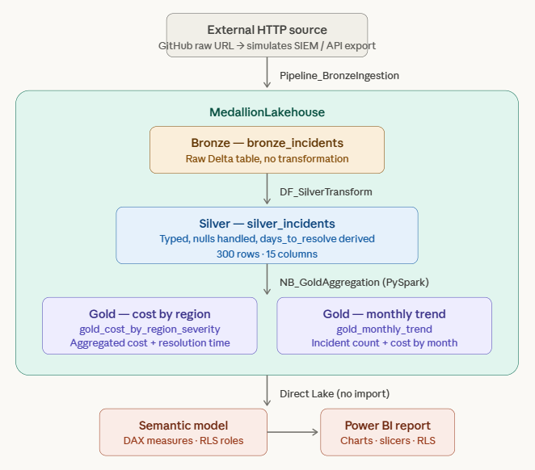

# Microsoft Fabric Capstone — End-to-End Cybersecurity Incident Analytics

> A full medallion architecture project built entirely on Microsoft Fabric, demonstrating end-to-end data engineering and analytics across Bronze, Silver, and Gold layers — from raw ingestion to governed reporting.

---

## Project Overview

This project simulates a real-world cybersecurity incident analytics pipeline, ingesting raw incident data from an external HTTP source and progressively refining it through a medallion architecture into a governed, reportable semantic model.

It was built as a hands-on capstone to consolidate skills across the Microsoft Fabric platform, covering data ingestion, transformation, aggregation, modelling, and reporting in a single coherent workflow.

**Domain:** Cybersecurity Incident Management  
**Dataset:** 300 synthetic incident records (INC-0001 to INC-0300) across 14 fields  
**Platform:** Microsoft Fabric (Trial Capacity)  

---

## Architecture

---

## Fabric Components Used

| Component | Object | Purpose |
|---|---|---|
| Data Pipeline | `Pipeline_BronzeIngestion` | HTTP → Delta ingestion, Copy Data activity |
| Lakehouse | `MedallionLakehouse` | Unified storage across all three layers |
| Dataflow Gen2 | `DF_SilverTransform` | Power Query-based cleaning and enrichment |
| Notebook | `NB_GoldAggregation` | PySpark aggregation into gold tables |
| Semantic Model | `CyberIncidentsSemModel` | Direct Lake model with DAX and RLS |
| Power BI Report | `CyberIncidents_Report` | Visual analytics layer |

---

## Dataset

`/data/cyber_incidents_raw.csv` — 300 rows, 14 columns

| Column | Description |
|---|---|
| `incident_id` | Unique identifier (INC-0001 to INC-0300) |
| `incident_date` | Date incident was raised |
| `incident_type` | Phishing, Ransomware, DDoS, etc. |
| `severity` | Low / Medium / High / Critical |
| `status` | Open / In Progress / Resolved / Closed |
| `affected_system` | ERP, CRM, Email Server, etc. |
| `department` | Business unit affected |
| `region` | North / South / East / West / Central |
| `assigned_analyst` | Analyst responsible |
| `resolution_date` | Date resolved (null if unresolved) |
| `estimated_cost_usd` | Financial impact estimate |
| `records_affected` | Number of records exposed |
| `is_regulatory_breach` | Yes / No / Under Review |
| `notes` | Free-text field |

> **Note:** This is entirely synthetic data generated for demonstration purposes. No real PII or sensitive information is present.

---

## Medallion Layer Design

### Bronze — Raw Ingestion
The pipeline pulls the CSV from an HTTP endpoint (simulating a real upstream source such as a SIEM export or ticketing system API) and lands it as a Delta table with no transformation. The raw state is preserved for auditability and reprocessing.

### Silver — Cleaned & Enriched
Dataflow Gen2 applies business-quality transformations via Power Query:
- Correct data types applied (`incident_date`, `resolution_date` as Date; `estimated_cost_usd` as Decimal; `records_affected` as Integer)
- Null handling: blank `resolution_date` values retained as null (unresolved incidents are valid records)
- Derived column added: `days_to_resolve = resolution_date - incident_date`
- Blank/invalid rows removed

### Gold — Aggregated for Analytics
A PySpark notebook produces two purpose-built aggregate tables:
- `gold_cost_by_region_severity` — total incidents, total cost, and average resolution time grouped by region and severity
- `gold_monthly_trend` — monthly incident count and cost grouped by incident type

---

## Semantic Model & Governance

- **Mode:** Direct Lake — queries Delta tables directly without import, enabling real-time reflection of upstream changes
- **Measures:** Total Cost, Total Incidents, Avg Days to Resolve
- **RLS:** `RegionFilter_North` role filters `silver_incidents` to North region only, assignable to specific user identities via workspace security settings. Can be expanded to other regions as well

> RLS self-testing via "Test as role" is not available in SSO-authenticated trial workspaces — the role enforces correctly for assigned users in production environments.

---

## How to Reproduce

1. Fork this repo and upload `data/cyber_incidents_raw.csv` to your own public GitHub repo
2. Copy the raw URL of the CSV
3. In Microsoft Fabric, create a workspace and a Lakehouse named `MedallionLakehouse`
4. Follow the layer-by-layer setup:
   - **Bronze:** Create a Data Pipeline with an HTTP source pointing to your raw CSV URL, destination set to `Tables/bronze_incidents`
   - **Silver:** Create a Dataflow Gen2 reading from `bronze_incidents`, apply transformations, output to `silver_incidents`
   - **Gold:** Create a Notebook attached to the Lakehouse, run the aggregation logic in `/notebooks/NB_GoldAggregation.ipynb`, output to gold tables
   - **Semantic Model:** Create a Direct Lake model over the Lakehouse, add DAX measures, configure RLS
   - **Report:** Build a Power BI report on the semantic model

---

## Key Concepts Demonstrated

- Medallion architecture (Bronze / Silver / Gold) on Microsoft Fabric
- Delta Lake format across all layers
- Direct Lake semantic model (no data import, queries Delta directly)
- Row-Level Security (RLS) configuration and assignment
- Pipeline orchestration with HTTP source
- Dataflow Gen2 with Power Query transformations
- PySpark aggregations in Fabric Notebooks
- Cross-layer data lineage within a single Lakehouse

---

## Tags

`microsoft-fabric` `delta-lake` `medallion-architecture` `power-bi` `dataflow-gen2` `pyspark` `direct-lake` `rls` `data-engineering` `cybersecurity-analytics` `dp-600`
